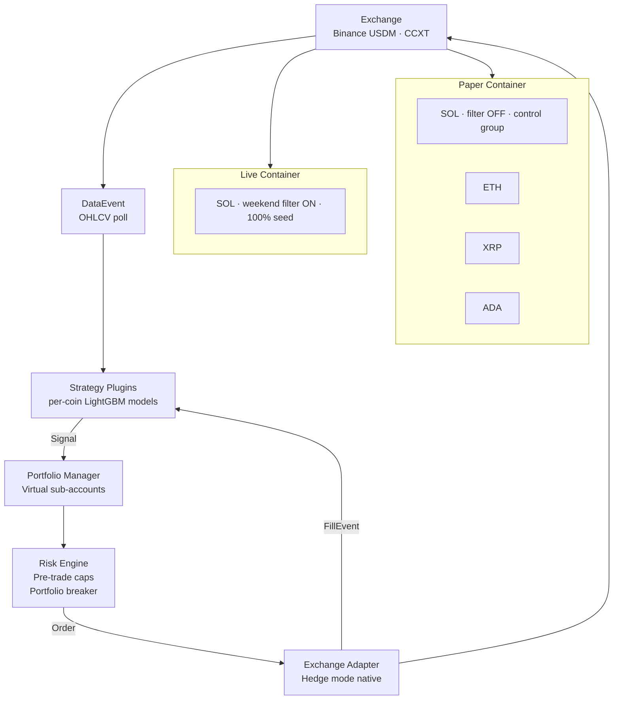

# Multi-Strategy Crypto Quant Framework

A live cryptocurrency futures system I rebuilt from the ground up as a plugin-based **multi-strategy framework** — independent per-coin ML strategies running under a unified portfolio manager, with paper and live operating as isolated containers that share the same code but behave differently.

---

## Background

This system is the result of two rounds of teardown.

The first round retired a price-prediction pipeline — 72 features, LSTM with attention, Triple Barrier labeling. The engineering worked. The alpha didn't. Out-of-sample performance degraded to random.

The second round retired the system that came out of the first pivot: a regime classifier with three parallel strategy engines (Aggressive / Adaptive / TrendFollowing) running on Bybit. It produced cleaner architecture but the regimes themselves didn't translate into operational alpha, and the three engines never genuinely diverged in behavior.

What I learned from both attempts:

1. **Architecture quality and strategy validity are independent.** A clean codebase can't rescue a weak signal.
2. **Single-coin, single-signal alpha is fragile.** Especially on BTC at retail scale on a single venue — I tried six different angles and retired all six.
3. **Backtest performance is upper-bounded, not predictive.** Live cumulative is the only honest metric.

This framework is the answer to those lessons. It assumes alpha is hard to find, easier to validate per-coin than across coins, and that operational safety has to be designed in from the start because it isn't a property the strategy provides.

---

## How It Works

Strategies emit `Signal` objects. The portfolio layer applies risk checks, sizes positions, and routes to the adapter. Strategies never touch the exchange directly. Adding a new coin means dropping a directory under `strategies/` and restarting the container — no registry, no decorator, no code change.

---

## Per-Coin Validation Framework

Every coin runs through the same multi-phase validation before it can be deployed. The framework is fixed; per-coin work moves through phases, and post-hoc relaxation of gates, seeds, or horizons is disallowed.

| Phase | Purpose |
|---|---|
| **A — Data audit** | Length, balance, gap, symbol consistency |
| **B — Feature gate** | IC filter on a fixed feature pack, multicollinearity check |
| **C — Horizon test** | Multi-horizon walk-forward Sharpe comparison |
| **C+ — Reproducibility guards** | Git-clean check, seed determinism, dry-run |
| **D — Full training** | Multiple configs × multiple seeds, RF sanity baseline, DSR |
| **E — Strict gates** | Twelve robustness gates (Sharpe, worst-fold, bootstrap, regime, cost stress, cross-correlation, etc.) |
| **F — Lockbox single-use** | A previously untouched holdout window, one shot only, marker file enforces it |
| **F+ — Plugin export** | Multi-seed ensemble committed to `strategies/<coin>/` |
| **G — Paper deploy + ramp** | Thirty-day paper run before any live capital ramp |

A precedent emerged during this run: **lockbox is the final gate**. Some coins fail one or two strict gates at backtest scale but pass the lockbox holdout cleanly. The pass criterion isn't being loosened after the fact — what's being formalized is *which gate has final authority*. Backtest-margin artifacts are tolerated when the operation-scale holdout is clean.

---

## Backtest vs Live — An Honest Asymmetry

The most important thing I learned in this rebuild is that backtest Sharpe is structurally inflated for this strategy family, by roughly 2×, and the cause is mechanical, not strategy-specific.

- **The backtest uses the already-completed higher-timeframe bar** at the signal time. A subtle look-ahead leaks into some features.
- **The live system only sees the in-progress higher-timeframe bar** at the same moment. Strictly causal.

The live environment is the conservative one. The first month of live operation on the lead coin held cumulative around +40% with Sharpe above seven — proving the alpha is real even though the backtest number was higher. The two statements ("backtest is inflated" and "live alpha exists") are not in conflict.

The evaluation policy that came out of this: backtest Sharpe is an upper-bound estimate; the actual yardstick is the live cumulative.

---

## Paper / Live Isolation

Paper and live run in separate Docker containers with separate state, logs, and heartbeat directories. They share strategy code but behave differently through environment-driven switches.

| | Paper container | Live container |
|---|---|---|
| Strategies | Four coins (one in control mode) | Lead coin only |
| Weekend filter | OFF | ON |
| Capital allocation | Conservative share per coin | Full allocation on the live coin |
| State / logs | Isolated host directory | Separate isolated host directory |
| Risk breaker | Per-container | Per-container |
| Telegram prefix | `[paper]` | `[live]` |

The current paper container also functions as a live experiment. The same model signal is gated on weekends in one container and allowed through in the other. After thirty days, comparing the two cumulative distributions becomes a clean test of whether the weekend-filter decision is real or sample luck.

A live-side incident cannot bleed into paper and vice versa. The first time this design earned its keep was on the launch day itself, when a paper-side incident was diagnosed and contained on its own timeline while the live launch proceeded in parallel.

---

## Operational Safety

### Per-strategy and portfolio-level risk

- Per-strategy: max daily loss, max drawdown, max position count, max leverage.
- Per-strategy alpha-decay kill switch: pauses after a streak of consecutive losses, auto-resumes after a cooldown.
- Portfolio-wide breaker: a joint-equity drawdown cap that auto-pauses every strategy and requires explicit confirmation to resume on the next start.

### Restart-safety patterns

Two restart pitfalls emerged in production and now have explicit guards:

1. **"Bars since entry" was being computed from wall-clock.** After a long container outage the elapsed wall time was being treated as bars held, triggering immediate horizon-exit on the first cycle back up. Every plugin now defers horizon-driven closes until the next natural bar after restart.

2. **In-memory paper positions were being misread as "exchange liquidation"** during the position-sync step after restart. The sync logic now branches on adapter type — the liquidation-inference path is skipped for the paper adapter — with a regression test pinning the pattern.

### Pre-launch safety

Twelve-item pre-flight checklist (authentication, permissions, IP whitelist, margin mode, hedge mode, model load, symbol match, isolation directories, etc.) and nine abort conditions defined before any live container is brought up. Each gate has explicit pass/fail criteria so a human decision isn't required mid-launch.

---

## Engineering Notes

**Hedge mode is account-level and irreversible.** Every order carries an explicit position side. The adapter idempotently enforces hedge mode and isolated margin on connect; the live launch is gated on both flags being correct.

**Adapter is a singleton per exchange.** Multiple strategies sharing an API key share the rate-limit budget. Concurrency lives in the adapter, not in each strategy.

**Plugin discovery by directory.** No registry, no decorator. Adding a coin is `cp -r strategies/_template strategies/new_coin`, edit a config file, restart the container. The framework auto-finds it.

**Heartbeat file as the liveness signal.** Each strategy task atomically writes a heartbeat file every poll cycle. The Docker healthcheck fails when any heartbeat is older than three poll intervals — the restart policy then takes over. Watching the process is not enough; watching data flow is what matters.

**Notification isolated from trading.** Telegram delivery failures cannot block trades. Every external I/O is wrapped in swallow-all-errors. The trade loop never waits on the notifier.

**Daily monitor on live.** A ten-line live-only daily summary (7d / 30d / 60d Sharpe, cumulative, hit rate, drawdown, weekend-filter activations, days since retrain) is sent at a fixed Korean local time, computed from the live trade log plus a read-only mount of the paper container's logs for cross-environment comparison.

---

## What's Running Today

| Container | Strategy count | Coins | Status |
|---|---|---|---|
| Live | 1 | Lead coin (weekend filter ON, full seed) | Live since mid-May 2026 |
| Paper | 4 | Lead coin (control mode) + three altcoins | Continuous paper since late April 2026 |

Six BTC alpha attempts have been retired. The current effort is concentrated on alt-coin coverage through the validation framework, with one coin upgraded to live and the others continuing as paper for forward validation.

---

## Tech Stack

| Layer | Technology |
|---|---|
| Language | Python 3.12 |
| Exchange | CCXT (Binance USDM Futures, hedge mode, isolated margin) |
| ML | LightGBM (per-coin two-class directional ensembles) |
| Statistics | scipy, statsmodels (bootstrap, DSR, VIF) |
| Data | pandas, numpy, Parquet |
| Storage | SQLite (WAL mode) with shutdown-only positions sync |
| Notifications | Telegram Bot API |
| Container | Docker, restart=always, heartbeat-based healthcheck |
| Infrastructure | AWS EC2, two isolated containers per host |

---

## Development Log

All design decisions, postmortems, and lessons live in [DEVELOPMENT_LOG.md](./DEVELOPMENT_LOG.md). The log goes back through the predecessor systems too — the price-prediction pipeline and the regime classifier — so the trajectory of decisions is visible, not just the current state.

Each entry follows the same format: background → problem or finding → decision → result and learnings. The goal is to show what each decision cost to figure out, not just what was built.

---

## Status

Live since mid-May 2026 on the lead coin. The three remaining altcoins are in continuous paper validation. The next thirty-day window will produce the first quantitative comparison of the weekend-filter decision (live with filter ON vs paper control with filter OFF), which will determine whether the filter is retained, dropped, or extended for further comparison.

The BTC line is paused until a genuinely new hypothesis appears (cross-exchange basis, multi-venue informational advantage). Until then, the marginal effort is better spent on additional alt-coin coverage and on hardening live operations.

---

*Strategy parameters, model artifacts, feature definitions, seed lists, capital ratios, and threshold values are intentionally not published in this repository.*
*This repo documents the system architecture, the validation framework, and the decision process behind both.*
